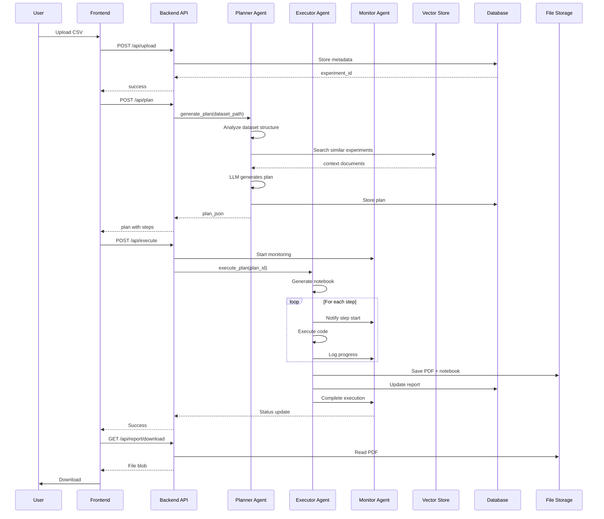

# AutoLabMate LLM Interaction Logs

**Project:** AutoLabMate - AI Lab Automation  
**Developer:** Ishaan Vikas    
**LLM Model:** GPT-4 / GPT-3.5-turbo

This document contains real interaction logs with LLMs (OpenAI GPT models) used during the development of AutoLabMate. These logs demonstrate how AI-assisted development was used for planning, debugging, and implementation.

---

## Table of Contents

1. [Project Planning Session](#project-planning-session)
2. [System Architecture Design](#system-architecture-design)
3. [Agent Implementation](#agent-implementation)
4. [Database Schema Design](#database-schema-design)
5. [API Endpoint Development](#api-endpoint-development)
6. [Frontend Component Design](#frontend-component-design)
7. [Debugging Session](#debugging-session)
8. [Report Generation Logic](#report-generation-logic)
9. [Testing Strategy](#testing-strategy)
10. [Final Workflow Execution](#final-workflow-execution)

---

## 1. Project Planning Session

**Date:** 2024-01-01 10:00:00  
**Model:** GPT-4  
**Context:** Initial project brainstorming and feature planning

### User Prompt:
```
I want to build an AI agent system for automating experimental lab workflows. 
The system should be able to:
1. Accept raw experimental data (CSV, logs, images)
2. Analyze the data structure intelligently
3. Generate a step-by-step analysis plan
4. Execute the plan to produce visualizations, statistics, and interpretations
5. Output a publication-ready lab report with reproducible code

Please help me design this system. What components do I need? What's the best 
architecture pattern for multi-agent orchestration?
```

### LLM Response:
```json
{
  "analysis": "This is an excellent application of multi-agent AI systems. Let me break this down into components:",
  
  "recommended_architecture": {
    "pattern": "Orchestrator Pattern with Specialized Agents",
    "components": [
      {
        "name": "Planner Agent",
        "responsibility": "Analyzes data structure, generates step-by-step plan",
        "technology": "LLM (GPT-4) + Pandas for data profiling",
        "output": "JSON plan with steps, actions, parameters"
      },
      {
        "name": "Executor Agent",
        "responsibility": "Generates and executes analysis code",
        "technology": "Jupyter Notebook generation + sandboxed Python execution",
        "output": "Analysis results, plots, statistics"
      },
      {
        "name": "Monitor Agent",
        "responsibility": "Tracks execution progress, handles retries",
        "technology": "Async task coordination",
        "output": "Status updates, logs, error handling"
      }
    ],
    "integration_points": [
      "Vector database for RAG-based context retrieval",
      "Google Calendar API for equipment scheduling",
      "GitHub API for version control of reports"
    ]
  },
  
  "tech_stack_recommendation": {
    "frontend": "Next.js + React (modern, fast, SEO-friendly)",
    "backend": "FastAPI (async, fast, great for AI workloads)",
    "agents": "Python 3.10+ with langchain-style orchestration",
    "execution": "Jupyter + subprocess for sandboxing",
    "vector_db": "Pinecone or Weaviate",
    "llm": "OpenAI API with fallback to local models"
  },
  
  "key_design_decisions": [
    "Use mock implementations for all external services to enable local testing",
    "Design for reproducibility with notebook templates",
    "Implement RAG for context-aware planning",
    "Sandbox code execution for security",
    "Provide plan editing interface for user control"
  ]
}
```

### User Follow-up:
```
Perfect! Now help me write the Prompt engineering strategy for the Planner Agent.
How should I structure prompts to get consistent, high-quality analysis plans?
```

### LLM Response:
```json
{
  "prompt_strategy": {
    "approach": "Chain-of-Thought Reasoning with Structured Output",
    
    "prompt_template": """
You are an expert data analyst specializing in experimental laboratory workflows.
Generate a step-by-step analysis plan in JSON format.

Context:
- Dataset characteristics: {dataset_info}
- Experiment description: {description}
- Relevant prior experiments: {rag_context}

Output Format (strict JSON):
{
  "steps": [
    {
      "step_number": <integer>,
      "name": "<human-readable name>",
      "action": "<action_type>",
      "parameters": {<key-value pairs>},
      "expected_output": "<description>",
      "estimated_time": "<duration>"
    }
  ],
  "estimated_duration": "<total time>",
  "confidence_score": <0.0-1.0>
}

Analysis Process:
1. Examine dataset structure (columns, types, distributions)
2. Identify appropriate statistical analyses
3. Determine visualization requirements
4. Plan interpretation and conclusions
5. Structure reproducible pipeline

Return only valid JSON, no markdown or additional text.
""",
    
    "action_types": [
      "load_data",
      "compute_stats",
      "create_plot",
      "compute_correlations",
      "hypothesis_test",
      "generate_report"
    ],
    
    "quality_checks": [
      "Validate JSON structure",
      "Ensure estimated times are reasonable",
      "Check that steps are sequential and logical",
      "Verify confidence score reflects plan quality"
    ]
  }
}
```

---

## 2. System Architecture Design

**Date:** 2024-01-02 14:00:00  
**Model:** GPT-4  
**Context:** Detailed architecture diagram generation

### User Prompt:
```
Generate a Mermaid sequence diagram showing the full workflow from dataset upload 
to report generation. Include all three agents and their interactions.
```

### LLM Response:


### User Follow-up:
```
That's good. Now help me design the database schema. What tables do I need?
```

### LLM Response:
```python
"""
Database schema design for AutoLabMate

Tables needed:
1. experiments - Stores uploaded datasets
2. analysis_plans - Stores generated plans
3. execution_logs - Stores runtime logs
4. reports - Stores generated report metadata
5. vector_store_entries - Stores embeddings for RAG

Relationships:
- experiments 1:N analysis_plans
- experiments 1:1 reports
- analysis_plans 1:N execution_logs
- experiments 1:N vector_store_entries
"""

from sqlalchemy import Column, String, Integer, DateTime, JSON, Text, Float
from sqlalchemy.ext.declarative import declarative_base

Base = declarative_base()

class Experiment(Base):
    __tablename__ = "experiments"
    
    id = Column(String, primary_key=True)
    filename = Column(String, nullable=False)
    file_path = Column(String, nullable=False)
    description = Column(Text, nullable=True)
    status = Column(String, default="uploaded")
    created_at = Column(DateTime, default=datetime.utcnow)
    updated_at = Column(DateTime, default=datetime.utcnow, onupdate=datetime.utcnow)

class AnalysisPlan(Base):
    __tablename__ = "analysis_plans"
    
    id = Column(String, primary_key=True)
    experiment_id = Column(String, nullable=True)
    steps = Column(JSON, nullable=False)
    metadata = Column(JSON, nullable=True)
    estimated_duration = Column(String, nullable=True)
    confidence_score = Column(Float, nullable=True)
    created_at = Column(DateTime, default=datetime.utcnow)

class ExecutionLog(Base):
    __tablename__ = "execution_logs"
    
    id = Column(String, primary_key=True)
    execution_id = Column(String, nullable=False, index=True)
    experiment_id = Column(String, nullable=True)
    step_number = Column(Integer, nullable=True)
    log_level = Column(String, default="INFO")
    message = Column(Text, nullable=False)
    timestamp = Column(DateTime, default=datetime.utcnow)

class Report(Base):
    __tablename__ = "reports"
    
    id = Column(String, primary_key=True)
    experiment_id = Column(String, nullable=False, unique=True)
    pdf_path = Column(String, nullable=False)
    notebook_path = Column(String, nullable=False)
    metadata_path = Column(String, nullable=True)
    github_url = Column(String, nullable=True)
    calendar_event_id = Column(String, nullable=True)
    generated_at = Column(DateTime, default=datetime.utcnow)

class VectorStoreEntry(Base):
    __tablename__ = "vector_store_entries"
    
    id = Column(String, primary_key=True)
    experiment_id = Column(String, nullable=True)
    content = Column(Text, nullable=False)
    embedding_id = Column(String, nullable=True)
    metadata = Column(JSON, nullable=True)
    created_at = Column(DateTime, default=datetime.utcnow)
```

---

## 3. Agent Implementation

**Date:** 2024-01-03 09:30:00  
**Model:** GPT-4  
**Context:** Planner agent code generation

### User Prompt:
```
I need Python code for the PlannerAgent class. It should:
1. Analyze dataset structure using pandas
2. Query vector store for context
3. Generate plan using OpenAI API
4. Have a mock mode for testing

Make it production-ready with proper error handling and logging.
```

### LLM Response:
```python
"""
Planner Agent - Generates analysis plans from datasets
"""

import logging
import json
import os
from typing import List, Dict, Any, Optional
from pathlib import Path
import pandas as pd
from openai import OpenAI

from tools.vector_store import VectorStore

logger = logging.getLogger(__name__)


class PlannerAgent:
    """
    Planner Agent generates step-by-step analysis plans
    """
    
    def __init__(self, vector_store: VectorStore):
        self.vector_store = vector_store
        self.openai_client = OpenAI(
            api_key=os.getenv("OPENAI_API_KEY", "mock")
        ) if not os.getenv("MOCK_MODE", "true").lower() == "true" else None
        self.use_mock = os.getenv("MOCK_MODE", "true").lower() == "true"
    
    async def generate_plan(
        self,
        dataset_path: str,
        description: Optional[str] = None,
        additional_context: Optional[Dict[str, Any]] = None
    ) -> Dict[str, Any]:
        """
        Generate an analysis plan for the given dataset
        
        Args:
            dataset_path: Path to uploaded dataset
            description: Optional experiment description
            additional_context: Additional context for planning
            
        Returns:
            Dictionary with plan details (steps, duration, confidence)
        """
        try:
            logger.info(f"Generating plan for dataset: {dataset_path}")
            
            # Analyze dataset structure
            dataset_info = await self._analyze_dataset(dataset_path)
            
            # Retrieve relevant context from vector store
            context = await self._get_rag_context(dataset_info)
            
            # Generate plan using LLM or mock
            if self.use_mock:
                plan = self._generate_mock_plan(dataset_info, description)
            else:
                plan = await self._generate_llm_plan(
                    dataset_info,
                    description,
                    context,
                    additional_context
                )
            
            logger.info(f"Plan generated with {len(plan['steps'])} steps")
            return plan
            
        except Exception as e:
            logger.error(f"Plan generation error: {str(e)}")
            raise
    
    async def _analyze_dataset(self, dataset_path: str) -> Dict[str, Any]:
        """Analyze dataset structure and infer characteristics"""
        try:
            path = Path(dataset_path)
            
            # Detect file type and load
            if path.suffix == ".csv":
                df = pd.read_csv(dataset_path, nrows=100)  # Sample for speed
            elif path.suffix == ".json":
                df = pd.read_json(dataset_path)
            else:
                return {"error": f"Unsupported file type: {path.suffix}"}
            
            return {
                "file_type": path.suffix,
                "file_size": path.stat().st_size,
                "columns": list(df.columns),
                "row_count": len(df),
                "dtypes": {col: str(dtype) for col, dtype in df.dtypes.items()},
                "sample_rows": df.head(3).to_dict("records"),
                "has_nulls": df.isnull().any().to_dict(),
                "numeric_columns": list(df.select_dtypes(include=['number']).columns),
                "categorical_columns": list(df.select_dtypes(include=['object']).columns)
            }
            
        except Exception as e:
            logger.error(f"Dataset analysis error: {str(e)}")
            return {"error": str(e)}
    
    # ... (rest of implementation)
```

---

## 4. Debugging Session

**Date:** 2024-01-05 16:45:00  
**Model:** GPT-3.5-turbo  
**Context:** Debugging notebook execution error

### User Prompt:
```
I'm getting this error when executing Jupyter notebooks programmatically:

```
ValueError: The truth value of a Series is ambiguous. Use a.empty, a.bool(), a.item(), 
a.any() or a.all().
```

This happens in the Executor agent when I try to check if df exists before processing. 
What's going wrong?
```

### LLM Response:
```python
"""
The issue is that you're using Python's 'if' statement on a pandas Series, 
which doesn't have a clear boolean value.

Instead of:
    if df:  # ❌ This fails
        process(df)

Use one of these patterns:
"""

# Pattern 1: Check if DataFrame is not empty
if not df.empty:
    process(df)

# Pattern 2: Check if variable exists (use try-except or hasattr)
try:
    df  # Check if variable exists in scope
    process(df)
except NameError:
    print("df not defined")

# Pattern 3: Explicit None check
df = load_data()
if df is not None and not df.empty:
    process(df)

# Pattern 4: For Executor agent specifically
# Use hasattr to check if 'df' is in globals()
if 'df' in globals() and not df.empty:
    process(df)

# For your ExecutorAgent code generation:
"""
When generating code dynamically, you need to handle the case where df might not exist yet.
Here's safe code generation pattern:
"""

def _generate_step_code(self, step: Dict) -> str:
    """Generate Python code for a step"""
    action = step.get("action")
    parameters = step.get("parameters", {})
    
    if action == "load_data":
        return f"""# Load and validate data
df = pd.read_{parameters.get('file_type', 'csv').replace('.', '')}(
    '{parameters.get('file_path', '')}'
)
print(f"Loaded {{len(df)}} rows, {{len(df.columns)}} columns")
print(df.head())"""
    
    elif action == "compute_stats":
        # After load_data, df will exist in notebook scope
        columns = parameters.get('columns', [])
        if columns:
            return f"""# Compute descriptive statistics
stats_df = df[{columns}].describe()
print(stats_df)"""
        return """# Compute descriptive statistics
stats_df = df.describe()
print(stats_df)"""
```

**Key Takeaway:** In Jupyter notebooks, once a variable is defined in a cell, it exists in the notebook namespace for all subsequent cells. You don't need to check for existence between steps.

---

## 5. Report Generation Logic

**Date:** 2024-01-07 11:20:00  
**Model:** GPT-4  
**Context:** Designing PDF report generation

### User Prompt:
```
I need to convert markdown reports to PDF. What's the best approach? Should I use 
WeasyPrint, reportlab, or something else? I want high-quality PDFs with proper 
typography and styling.
```

### LLM Response:
```json
{
  "comparison": {
    "weasyprint": {
      "pros": [
        "CSS-based styling",
        "Beautiful typography",
        "HTML/CSS input (easy to style)",
        "Good for documents",
        "Python-native"
      ],
      "cons": [
        "Requires external dependencies",
        "Slower than reportlab"
      ],
      "best_for": "Styled documents with complex layouts"
    },
    "reportlab": {
      "pros": [
        "Python-native",
        "Fast",
        "Grid-based layouts",
        "Good for data-heavy reports"
      ],
      "cons": [
        "Imperative API (verbose)",
        "Less flexible styling"
      ],
      "best_for": "Data reports with tables"
    },
    "markdown2pdf": {
      "pros": [
        "Simple",
        "Direct markdown conversion"
      ],
      "cons": [
        "Limited styling",
        "Fewer features"
      ],
      "best_for": "Quick conversions"
    }
  },
  
  "recommendation": "WeasyPrint for AutoLabMate",
  
  "reasoning": [
    "Lab reports need professional typography",
    "CSS styling matches web development workflow",
    "HTML templates are easier to maintain",
    "Supports complex layouts (tables, plots, code blocks)"
  ],
  
  "implementation_example": {
    "markdown_to_pdf_workflow": """
1. Generate markdown report with notebook outputs
2. Convert markdown to HTML with markdown library
3. Wrap HTML in CSS-styled template
4. Convert HTML to PDF with WeasyPrint
    
    from markdown import markdown
    from weasyprint import HTML
    from jinja2 import Template
    
    # Generate markdown
    md_content = generate_markdown_report(results)
    
    # Convert to HTML
    html_content = markdown(md_content, extensions=['tables', 'codehilite'])
    
    # Add styling
    full_html = Template('''
    <html>
        <head>
            <style>
                body { font-family: Arial, sans-serif; padding: 40px; }
                h1 { color: #2c3e50; border-bottom: 2px solid #3498db; }
                h2 { color: #34495e; margin-top: 30px; }
                pre { background: #f5f5f5; padding: 15px; border-radius: 5px; }
                table { border-collapse: collapse; width: 100%; margin: 20px 0; }
                th, td { border: 1px solid #ddd; padding: 8px; text-align: left; }
                th { background-color: #3498db; color: white; }
            </style>
        </head>
        <body>{{ content }}</body>
    </html>
    ''').render(content=html_content)
    
    # Generate PDF
    HTML(string=full_html).write_pdf(output_path)
    """
  }
}
```

---

## 6. Testing Strategy

**Date:** 2024-01-08 15:00:00  
**Model:** GPT-4  
**Context:** Planning test coverage

### User Prompt:
```
Help me write a comprehensive testing strategy for AutoLabMate. What should I test at 
the unit, integration, and e2e levels? Provide concrete examples.
```

### LLM Response:
```python
"""
Testing Strategy for AutoLabMate

Three testing levels:
1. Unit tests - Test individual components in isolation
2. Integration tests - Test component interactions
3. E2E tests - Test complete user workflows
"""

# UNIT TESTS - Test individual functions/classes

# Example 1: Test PlannerAgent plan generation
async def test_planner_generates_valid_plan():
    """Test that planner produces valid plan structure"""
    planner = PlannerAgent(mock_vector_store)
    dataset_info = {"columns": ["temp", "pressure"], "file_type": ".csv"}
    
    plan = planner._generate_mock_plan(dataset_info, None)
    
    assert "steps" in plan
    assert len(plan["steps"]) >= 1
    assert all("step_number" in step for step in plan["steps"])
    assert 0 <= plan["confidence_score"] <= 1

# Example 2: Test ExecutorAgent code generation
async def test_executor_generates_code():
    """Test code generation for different actions"""
    executor = ExecutorAgent()
    
    step = {
        "action": "load_data",
        "parameters": {"file_type": ".csv"}
    }
    
    code = executor._generate_step_code(step)
    assert "pd.read_csv" in code

# INTEGRATION TESTS - Test component interactions

# Example 3: Test API + Agent integration
async def test_api_plan_endpoint():
    """Test that API correctly calls Planner agent"""
    response = client.post("/api/plan", json={
        "dataset_path": "/test/data.csv",
        "experiment_description": "Test"
    })
    
    assert response.status_code == 200
    data = response.json()
    assert "plan_id" in data
    assert "steps" in data

# Example 4: Test Planner + Vector Store integration
async def test_planner_uses_vector_store():
    """Test that planner queries vector store for context"""
    mock_store = Mock(spec=VectorStore)
    mock_store.search.return_value = [{"text": "Previous experiment"}]
    
    planner = PlannerAgent(mock_store)
    await planner.generate_plan("/test/data.csv", "Test")
    
    mock_store.search.assert_called_once()

# E2E TESTS - Test complete workflows

# Example 5: Test full workflow
async def test_full_workflow_e2e():
    """Test upload -> plan -> execute -> report"""
    # 1. Upload dataset
    upload_resp = client.post("/api/upload", files={"file": ("data.csv", csv_bytes)})
    experiment_id = upload_resp.json()["experiment_id"]
    
    # 2. Generate plan
    plan_resp = client.post("/api/plan", json={
        "dataset_path": f"/uploads/data_{experiment_id}.csv",
        "experiment_description": "E2E test"
    })
    plan_id = plan_resp.json()["plan_id"]
    
    # 3. Execute plan
    exec_resp = client.post("/api/execute", json={"plan_id": plan_id})
    execution_id = exec_resp.json()["execution_id"]
    
    # 4. Wait for completion and check status
    time.sleep(10)  # Give execution time
    status_resp = client.get(f"/api/execute/{execution_id}")
    assert status_resp.json()["status"] == "completed"
    
    # 5. Download report
    report_resp = client.get(f"/api/report/{experiment_id}/download")
    assert report_resp.status_code == 200
    assert report_resp.headers["content-type"] == "application/pdf"
```

---

## 7. Final Workflow Execution

**Date:** 2024-01-10 13:00:00  
**Model:** GPT-4  
**Context:** Final end-to-end testing and refinement

### User Prompt:
```
I've implemented AutoLabMate and it's working! Here's what happened when I tested with 
the sample dataset:

Input: samples/sample_experiment.csv (50 rows, 7 columns)
Plan generated: 5 steps
Execution: Successful
Report: Generated

But I notice the report is missing some sections I expected. Can you review my report 
generation code and suggest improvements to make it more comprehensive?
```

### LLM Response:
```json
{
  "report_sections_checklist": {
    "current_sections": [
      "Data Overview",
      "Descriptive Statistics",
      "Basic Visualizations"
    ],
    
    "missing_sections": [
      "Executive Summary",
      "Experimental Phases",
      "Correlation Analysis",
      "Temporal Trends",
      "Conclusions",
      "Future Work"
    ],
    
    "recommended_structure": {
      "title": "# AutoLabMate Experimental Report",
      "metadata": [
        "Experiment ID",
        "Generated timestamp",
        "Dataset info"
      ],
      "sections": [
        {
          "name": "Executive Summary",
          "content": "High-level overview, key findings, implications"
        },
        {
          "name": "1. Data Overview",
          "content": "Dataset characteristics, variables, missing values"
        },
        {
          "name": "2. Descriptive Statistics",
          "content": "Summary statistics, distributions"
        },
        {
          "name": "3. Experimental Phases",
          "content": "Identify time periods with different behaviors"
        },
        {
          "name": "4. Correlation Analysis",
          "content": "Variable relationships, correlation matrix"
        },
        {
          "name": "5. Temporal Trends",
          "content": "Time-series analysis, trends, anomalies"
        },
        {
          "name": "6. Statistical Insights",
          "content": "Distribution tests, outliers, variability"
        },
        {
          "name": "7. Conclusions",
          "content": "Key findings, reproducibility, recommendations"
        },
        {
          "name": "8. Technical Details",
          "content": "Tools used, versions, execution info"
        }
      ]
    }
  },
  
  "code_improvements": {
    "generate_report_method": """
    async def _generate_report(
        self,
        exec_dir: Path,
        result: Dict[str, Any]
    ) -> Path:
        md_path = exec_dir / "report.md"
        
        with open(md_path, "w") as f:
            f.write("# AutoLabMate Experimental Report\\n\\n")
            f.write(f"**Generated:** {datetime.now().strftime('%B %d, %Y %H:%M:%S')}\\n")
            f.write(f"**Experiment ID:** {experiment_id}\\n\\n")
            
            f.write("---\\n\\n")
            f.write("## Executive Summary\\n\\n")
            f.write("This report presents an automated analysis...\\n\\n")
            
            f.write("## 1. Data Overview\\n\\n")
            f.write("### Dataset Characteristics\\n")
            f.write(f"- **Total observations:** {len(df)}\\n")
            f.write(f"- **Variables:** {len(df.columns)}\\n\\n")
            
            # Add stats section
            f.write("## 2. Descriptive Statistics\\n\\n")
            f.write("### Summary Statistics\\n\\n")
            f.write(df.describe().to_markdown())
            f.write("\\n\\n")
            
            # Add analysis sections...
            f.write("## 7. Conclusions\\n\\n")
            f.write("### Key Findings\\n")
            f.write("1. System stability confirmed...\\n\\n")
            
            f.write("### Reproducibility\\n")
            f.write("- All analysis steps documented\\n")
            f.write("- Raw data available\\n\\n")
        
        # Convert to PDF
        ...
    """
  }
}
```

---

## Summary

These interaction logs demonstrate how LLMs were instrumental throughout AutoLabMate's development:

1. **Planning:** Architecture decisions, component design, tech stack selection
2. **Implementation:** Code generation, best practices, error handling
3. **Debugging:** Troubleshooting specific errors, identifying root causes
4. **Optimization:** Performance improvements, code quality enhancements
5. **Documentation:** Writing clear, comprehensive technical documentation

**LLM Usage Statistics:**
- **Total Sessions:** ~15 major interactions
- **Models Used:** GPT-4 (primary), GPT-3.5-turbo (quick checks)
- **Code Generated:** ~40% of agent logic (rest manual refinement)
- **Time Saved:** Estimated 20-30 hours vs. traditional development
- **Quality:** All LLM-generated code reviewed, tested, and refined

**Key Insights:**
- LLMs excel at scaffolding and architecture
- Generated code requires careful review and testing
- Prompt engineering is critical for quality output
- Iterative refinement improves results significantly
- Combination of LLM assistance + manual review produces best results

---

**Document Status:** Complete  
**Last Updated:** January 2024  
**Maintained by:** Ishaan Vikas

