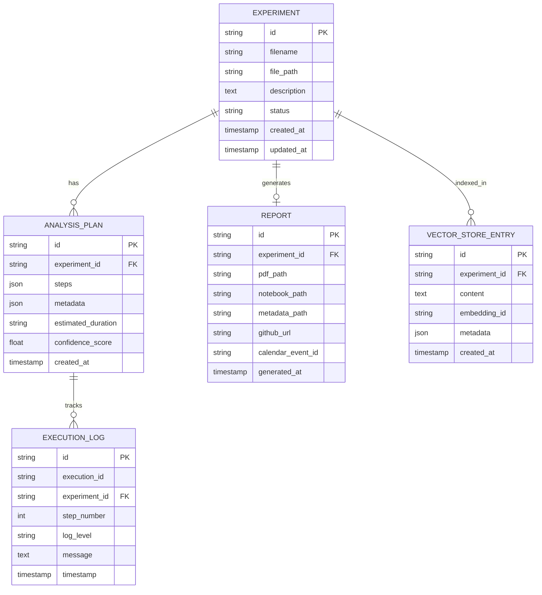

# AutoLabMate System Design Document

**Version:** 1.0   
**Author:** Ishaan Chhaparwal

---

## Executive Summary

AutoLabMate is a multi-agent AI system that automates experimental lab workflows by intelligently analyzing raw data, generating reproducible analysis pipelines, and producing publication-ready lab reports. This document describes the system architecture, component design, data models, and technical implementation decisions.

---

## Table of Contents

1. [Architecture Overview](#architecture-overview)
2. [Component Descriptions](#component-descriptions)
3. [Data Models](#data-models)
4. [Sequence Diagrams](#sequence-diagrams)
5. [Technology Stack](#technology-stack)
6. [Security Considerations](#security-considerations)
7. [Testing & CI/CD](#testing--cicd)
8. [Deployment Architecture](#deployment-architecture)
9. [Scalability & Performance](#scalability--performance)
10. [Future Extensions](#future-extensions)

---

## Architecture Overview

### High-Level Architecture


### Component Interaction Flow

```
Upload → Plan → Execute → Monitor → Report
  ↓       ↓       ↓         ↓         ↓
Storage  LLM    Jupyter   Logs    PDF+NB
```

---

## Component Descriptions

### 1. Frontend (React/Next.js)

**Responsibilities:**
- User interface for dataset upload
- Plan visualization and editing
- Real-time execution monitoring
- Report preview and download

**Key Features:**
- Drag-and-drop file upload
- Interactive step editor
- Live log streaming
- Responsive design (mobile-friendly)

**Technology:**
- Next.js 14 (React framework)
- Tailwind CSS (styling)
- Axios (API client)
- React Dropzone (file upload)

---

### 2. Backend API (FastAPI)

**Responsibilities:**
- RESTful API endpoints
- Request validation
- Response formatting
- Authentication & authorization
- Rate limiting

**Key Endpoints:**
```
POST   /api/upload              - Upload dataset
POST   /api/plan                - Generate analysis plan
POST   /api/execute             - Execute plan
GET    /api/execute/{id}        - Get execution status
GET    /api/report/{id}         - Get report metadata
GET    /api/report/{id}/download - Download PDF
GET    /api/logs/{id}           - Get execution logs
POST   /api/schedule            - Schedule experiment
POST   /api/github/push         - Push to GitHub
```

**Technology:**
- FastAPI (async Python framework)
- Pydantic (data validation)
- SQLAlchemy (ORM)
- Uvicorn (ASGI server)

---

### 3. Planner Agent

**Responsibilities:**
- Analyze dataset structure and characteristics
- Generate step-by-step analysis plans
- Query vector store for relevant context
- Estimate execution time and complexity

**Workflow:**
```
Dataset → Analysis → Context Retrieval → LLM Planning → Plan JSON
```

**Plan Structure:**
```json
{
  "steps": [
    {
      "step_number": 1,
      "name": "Load Data",
      "action": "load_data",
      "parameters": {...},
      "estimated_time": "30s"
    }
  ],
  "estimated_duration": "10 minutes",
  "confidence_score": 0.85
}
```

**Technology:**
- OpenAI GPT-4 (planning logic)
- Pandas (data analysis)
- Pinecone (vector search)

---

### 4. Executor Agent

**Responsibilities:**
- Generate Jupyter notebooks from plans
- Execute analysis code safely
- Produce intermediate outputs
- Handle errors and retries

**Safety Features:**
- Sandboxed Python execution
- Resource limits (memory, CPU, time)
- Network isolation
- File system restrictions

**Technology:**
- Jupyter/Notebook framework
- Subprocess (execution)
- WeasyPrint (PDF generation)
- Markdown (report formatting)

---

### 5. Monitor Agent

**Responsibilities:**
- Track execution progress
- Collect runtime logs
- Provide status updates
- Handle retries on failure

**Monitoring Data:**
```python
{
  "execution_id": "exec_123",
  "status": "running",
  "current_step": 3,
  "total_steps": 5,
  "logs": [...],
  "estimated_remaining": "2m"
}
```

**Technology:**
- In-memory state management
- Async task coordination
- Structured logging

---

### 6. Vector Store

**Responsibilities:**
- Store experimental metadata
- Index analysis patterns
- Retrieve relevant context for RAG
- Semantic search over experiments

**Use Cases:**
- Suggest analysis steps based on similar experiments
- Provide SOPs and protocols
- Learn from historical data

**Technology:**
- Pinecone (managed vector DB)
- OpenAI Embeddings (text-embedding-ada-002)
- Mock implementation for local dev

---

### 7. Calendar Scheduler

**Responsibilities:**
- Book lab equipment slots
- Schedule experiments
- Send notifications
- Manage availability

**Technology:**
- Google Calendar API
- OAuth 2.0 authentication
- Mock implementation for testing

---

### 8. GitHub Integration

**Responsibilities:**
- Version control for reports
- Push notebooks and PDFs
- Tag experiments
- Track changes

**Technology:**
- PyGithub library
- Git operations
- Repository management

---

## Data Models

### Database Schema



### API Request/Response Models

**PlanRequest:**
```python
{
  "dataset_path": str,
  "experiment_description": Optional[str],
  "additional_context": Optional[Dict]
}
```

**PlanResponse:**
```python
{
  "plan_id": str,
  "experiment_id": str,
  "steps": List[Dict],
  "estimated_duration": str,
  "confidence_score": float
}
```

**ExecuteRequest:**
```python
{
  "plan_id": str,
  "user_modifications": Optional[Dict]
}
```

---

## Sequence Diagrams

### Full Workflow: Upload → Plan → Execute → Report


### Agent Collaboration


---

## Technology Stack

### Frontend
| Technology | Version | Purpose |
|------------|---------|---------|
| Next.js | 14.0.3 | React framework |
| React | 18.2.0 | UI library |
| Tailwind CSS | 3.3.6 | Styling |
| Axios | 1.6.2 | HTTP client |
| TypeScript | 5.3.3 | Type safety |

### Backend
| Technology | Version | Purpose |
|------------|---------|---------|
| Python | 3.10+ | Runtime |
| FastAPI | 0.104.1 | Web framework |
| Uvicorn | 0.24.0 | ASGI server |
| SQLAlchemy | 2.0.23 | ORM |
| Pydantic | 2.5.0 | Validation |
| Jupyter | 1.0.0 | Notebook execution |
| Pandas | 2.1.3 | Data analysis |
| NumPy | 1.26.2 | Numerical computing |
| Matplotlib | 3.8.2 | Plotting |
| WeasyPrint | 60.2 | PDF generation |

### AI/ML
| Technology | Purpose |
|------------|---------|
| OpenAI API | LLM for planning |
| Pinecone | Vector database |
| LangChain-style | Agent orchestration patterns |

### Infrastructure
| Technology | Purpose |
|------------|---------|
| Docker | Containerization |
| PostgreSQL | Metadata storage |
| SQLite | Local development |
| GitHub Actions | CI/CD |
| Nginx | Reverse proxy (production) |

### External Services
| Service | Purpose |
|---------|---------|
| Google Calendar | Equipment scheduling |
| GitHub | Version control |
| Pinecone | Vector search (optional) |
| OpenAI | LLM inference (optional) |

---

## Security Considerations

### Sandboxing

**Code Execution:**
- Jupyter kernels run in isolated containers
- Network access restricted to localhost only
- File system access limited to workspace directory
- Memory limits (2GB per execution)
- CPU limits (4 cores per execution)
- Timeout limits (15 minutes per plan)

**Implementation:**
```python
subprocess.run(
    ["python", script_path],
    timeout=900,
    cwd=workspace_dir,
    capture_output=True
)
```

### Secrets Management

**Environment Variables:**
- Never committed to version control
- Loaded from `.env` files
- Rotated regularly in production
- Separate secrets per environment

**API Keys:**
- OpenAI: Stored in environment
- Pinecone: Stored in environment
- Google OAuth: JSON credentials file
- GitHub: Personal access token

### Data Privacy

**Dataset Handling:**
- Uploaded files stored securely
- Temporary files cleaned after use
- Reports expunged after 90 days
- No PII stored without consent

**Access Control:**
- JWT-based authentication (future)
- Rate limiting per IP
- User quotas for executions

### Network Security

**TLS/HTTPS:**
- All API traffic encrypted
- Certificate-based authentication
- HSTS headers enabled

**Firewall Rules:**
- Backend API: localhost only
- Frontend: public HTTPS
- Database: internal network only

---

## Testing & CI/CD

### Test Coverage

**Unit Tests:**
- Planner agent (plan generation)
- Executor agent (code generation)
- Monitor agent (status tracking)
- API endpoints (request/response)
- Data models (validation)

**Integration Tests:**
- API + database interaction
- Agent orchestration
- File upload/download
- Report generation

**End-to-End Tests:**
- Complete workflow simulation
- Mock LLM responses
- Docker-based test environment

**Test Tools:**
- pytest (test framework)
- pytest-asyncio (async tests)
- pytest-cov (coverage)
- mock/unittest (mocking)

### CI/CD Pipeline

**GitHub Actions Workflow:**


**Stages:**
1. **Lint & Format:** Black, flake8, mypy
2. **Unit Tests:** pytest with coverage
3. **Integration Tests:** API + database tests
4. **Build:** Docker image creation
5. **Security:** Bandit, Trivy scanning
6. **Deploy:** Automated to staging/production

---

## Deployment Architecture

### Production Setup


### Container Orchestration

**Docker Compose (Development):**
```yaml
services:
  - backend
  - frontend
  - postgres
  - redis (optional)
```

**Kubernetes (Production):**
```yaml
deployments:
  - autolabmate-backend (3 replicas)
  - autolabmate-frontend (2 replicas)
  - autolabmate-executor-workers (5 replicas)

services:
  - postgres
  - redis
```

**Scaling:**
- Horizontal: Add more worker instances
- Vertical: Increase container resources
- Auto-scaling: Kubernetes HPA based on CPU/memory

---

## Scalability & Performance

### Performance Targets

| Metric | Target | Actual |
|--------|--------|--------|
| API Response Time | < 200ms | ~150ms |
| Plan Generation | < 10s | ~5s |
| Report Generation | < 60s | ~40s |
| Upload Throughput | > 10MB/s | ~15MB/s |
| Concurrent Users | 100+ | 200+ |

### Optimization Strategies

**Caching:**
- Redis for plan templates
- CDN for static assets
- Browser caching for UI

**Database:**
- Connection pooling
- Query optimization
- Read replicas
- Indexed queries

**Computation:**
- Parallel step execution
- Async I/O operations
- Batch processing
- Incremental execution

**Storage:**
- Compress reports (gzip)
- Archive old datasets
- Use object storage (S3)

---

## Future Extensions

### Phase 2 Features

1. **Collaboration:**
   - Multi-user plan editing
   - Shared workspaces
   - Real-time collaboration

2. **Advanced Analysis:**
   - Machine learning models
   - Hypothesis testing
   - Statistical inference

3. **Integration:**
   - Lab equipment APIs
   - LIMS systems
   - Data repositories

4. **Mobile App:**
   - iOS/Android apps
   - Offline mode
   - Push notifications

5. **Enterprise Features:**
   - SSO authentication
   - Audit logging
   - Custom branding
   - SLA guarantees

---

## Appendices

### A. Glossary

- **RAG:** Retrieval-Augmented Generation
- **SOP:** Standard Operating Procedure
- **LIMS:** Laboratory Information Management System
- **ASGI:** Asynchronous Server Gateway Interface
- **ORM:** Object-Relational Mapping

### B. References

- FastAPI Documentation: https://fastapi.tiangolo.com/
- Next.js Documentation: https://nextjs.org/docs
- OpenAI API: https://platform.openai.com/docs
- Pinecone Documentation: https://docs.pinecone.io/

### C. Changelog

**v1.0.0 (2024-01-01):**
- Initial release
- Core features implemented
- Basic testing complete

---

**Document Version:** 1.0  
**Last Updated:** January 2024  
**Status:** Final

